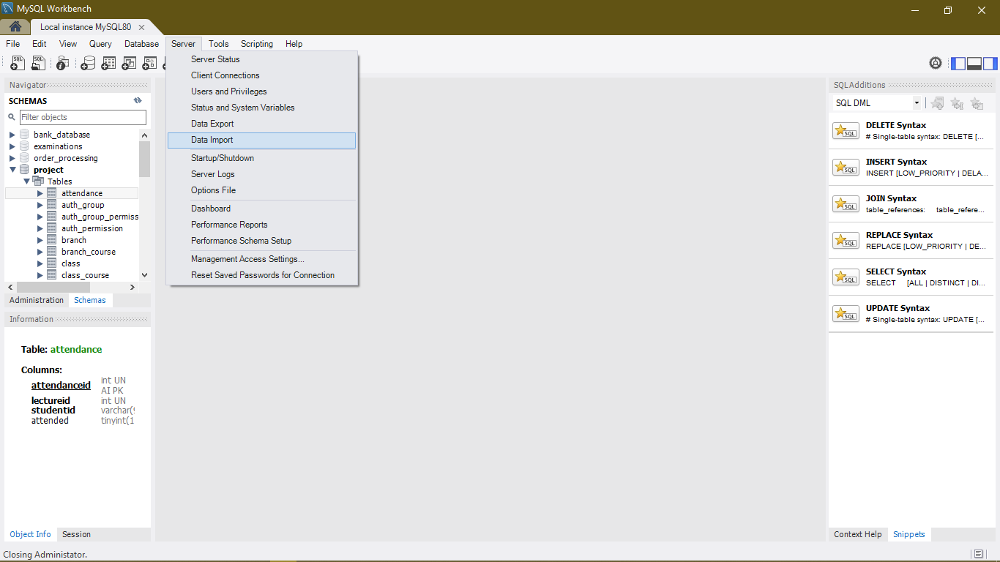
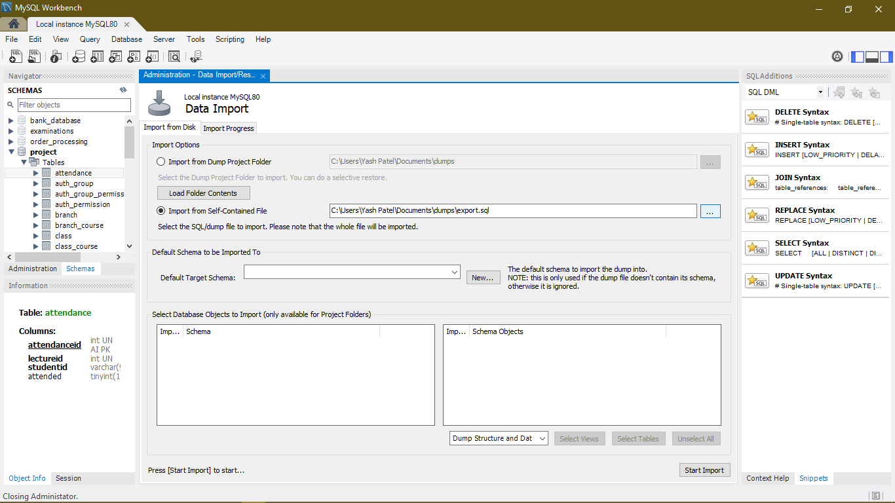
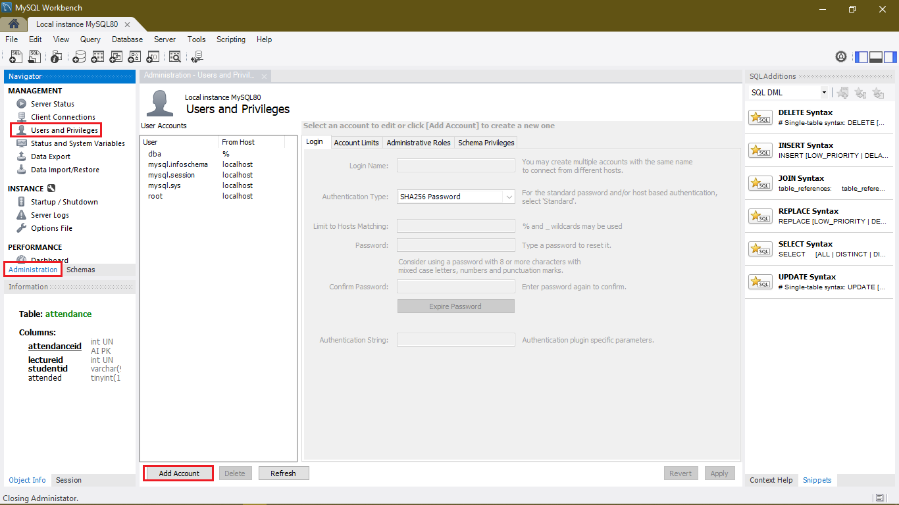
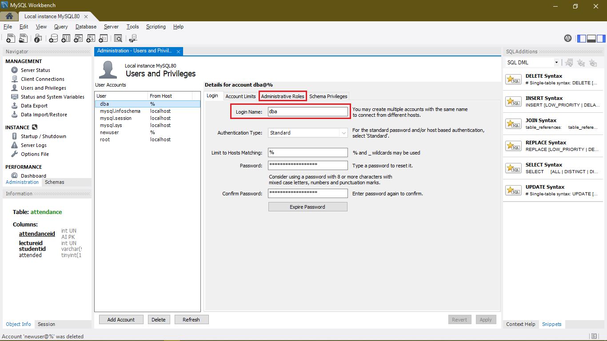
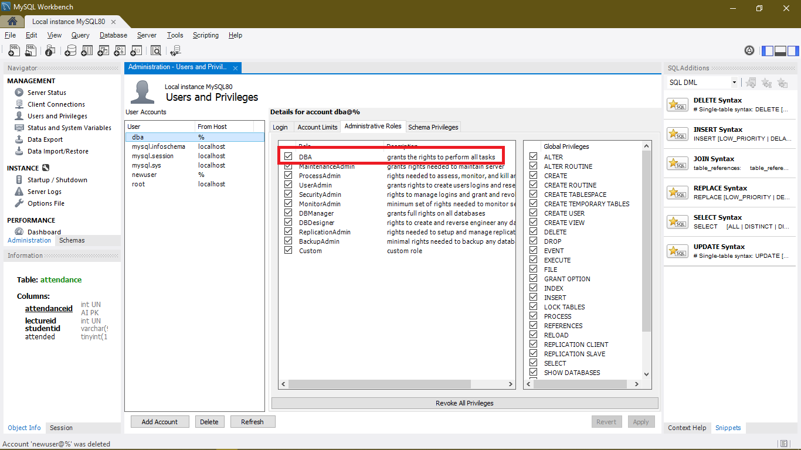

# Institute Management System 🎓

An ERP software for Institutes and Colleges.


## Installation ⚙️

1.Import ```DB_Export.sql``` from My SQL workbench & select ``` Data Import ``` 




2. select ``` Import form self contained  file ``` & click on ``` Start import ```





3.Create New User



5. Use **Usrename** :  ```dba``` & **Password** : ```dba@django```



6. Give **DBA**(All the permissions) to the user



7. Clone this repository 💥
```bash
git clone https://github.com/YashPatel1311/Institute_erp.git
```
8. Install ```requirements.txt``` 🎉
```bash
pip install -r requirements.txt
```

## Usage 📚

1. Go to ```Institute_erp``` directory
```bash
cd Institute_erp
```
2. Run this command 
```bash
python manage.py makemigrations
python manage.py migrate
```

. Strat your server 🚀
```bash
python manage.py runserver
```

3. Now open your browser & open this URL 
```bash
127.0.0.1:8000
```


## Contributers 👨‍💻

[Darshan Patel](https://github.com/darshanpatel44)

[Yash Patel](https://github.com/YashPatel1311)

## License 📋
[MIT](https://choosealicense.com/licenses/mit/)
