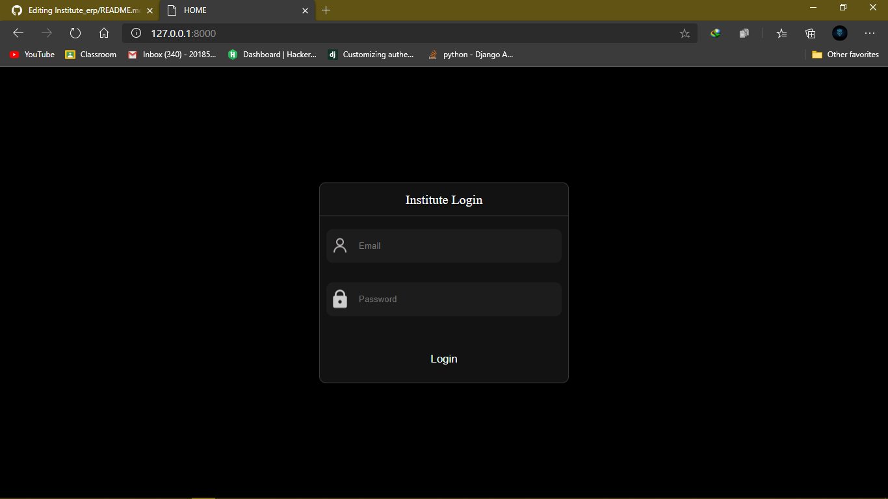
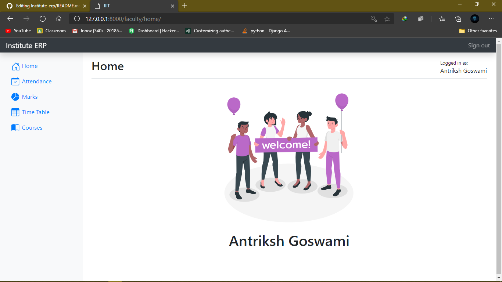
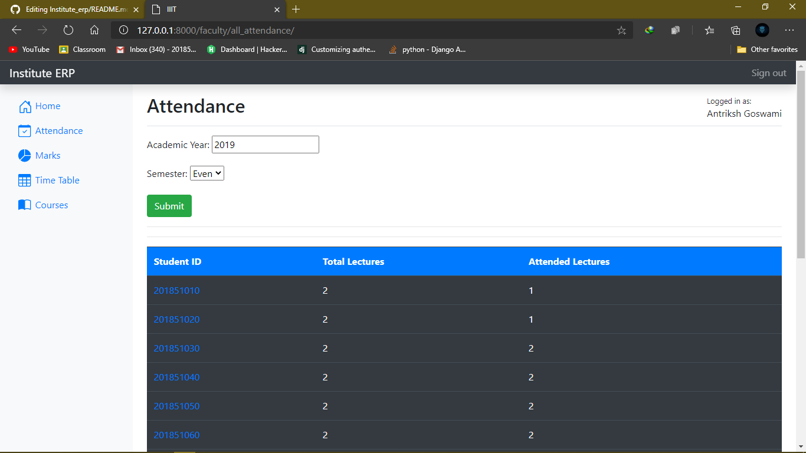
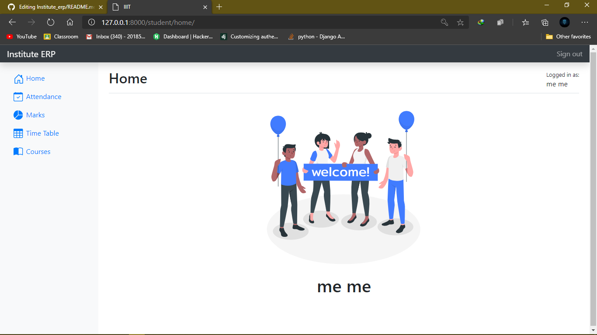
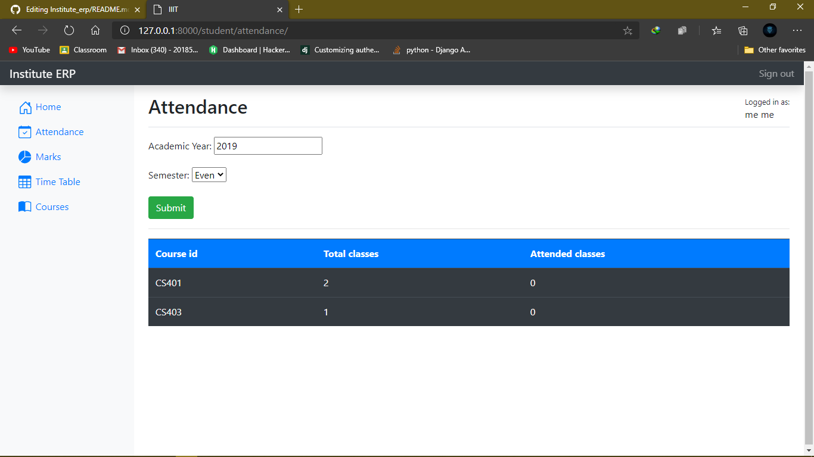
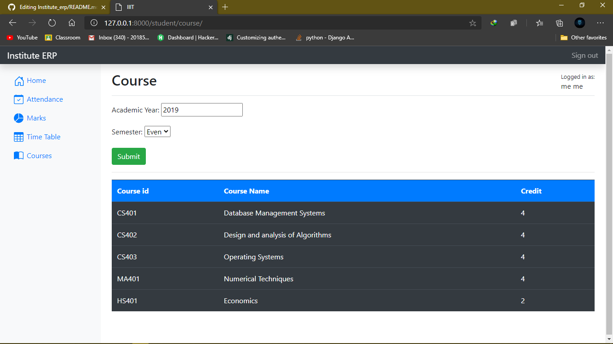
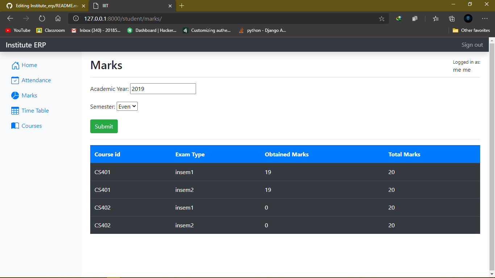

# Institute Management System 🎓

An ERP software for Institutes and Colleges.


## Installation ⚙️

1. Select ``` Data Import ``` & Import ```DB_Export.sql``` from My SQL workbench   


2. Select ``` Import form self contained  file ``` & click on ``` Start import ```


3. Click on administration,then User and Privileges and then Create New User


5. Use **Usrename** :  ```dba``` & **Password** : ```dba@django```


6. Assign **DBA** Role to the user


7. Clone this repository 💥
```bash
git clone https://github.com/YashPatel1311/Institute_erp.git
```
8. Install ```requirements.txt``` 🎉
```bash
pip install -r requirements.txt
```

## Usage 📚

1. Go to ```Institute_erp``` directory
```bash
cd Institute_erp
```
2. Run this command 
```bash
python manage.py makemigrations
python manage.py migrate
```

3. Strat your server 🚀
```bash
python manage.py runserver
```

4. Now open your browser & open this URL 
```bash
127.0.0.1:8000
```

## Screenshots 🖼️
>**LogIn Page :**
>
>

***

>### Faculty Module ###
>>   **FacultyHome Page :**
>>  
>  
>>  **FacultyAllAttendance Page :**
>>  

***

>### Student Module ###
>>  **StudentHome Page :**
>>  
>  
>>  **StudentAttendance Page :**
>>  
>  
>>  **StudentCourses Page :**
>>  
>  
>>  **StudentMarks Page :**
>>  

***


## Contributers 👨‍💻

[Darshan Patel](https://github.com/darshanpatel44)

[Yash Patel](https://github.com/YashPatel1311)

## License 📋
[MIT](https://choosealicense.com/licenses/mit/)
